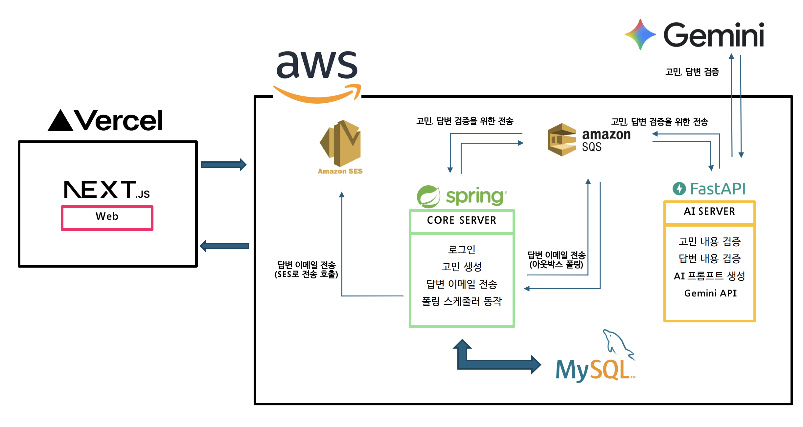

# Nayami

익명으로 고민을 나누고, 누구나 답변할 수 있는 고민 공유 서비스

> **개인 프로젝트**
>
> **현재 상태**: 배포 완료, 알파 테스트 진행 중 (2026.05 ~)

---

## 목차

- [서비스 소개](#서비스-소개)
- [기술 스택](#기술-스택)
- [시스템 아키텍처](#시스템-아키텍처)
- [핵심 설계 판단](#핵심-설계-판단)
  - [1. Core 서버와 AI 서버 분리](#1-core-서버와-ai-서버-분리)
  - [2. 트랜잭셔널 아웃박스 패턴](#2-트랜잭셔널-아웃박스-패턴)
  - [3. LLM 기반 콘텐츠 검수](#3-llm-기반-콘텐츠-검수)

---

## 서비스 소개

혼자 삼키기 어려운 고민을 익명으로 털어놓고, 다른 사용자가 답변을 남길 수 있는 서비스입니다. 답변이 등록되면 고민 작성자에게 이메일로 전달됩니다.

익명 서비스이기에 두 가지 문제를 해결해야 했습니다.

1. **콘텐츠 품질** — 익명성은 부적절하거나 서비스 취지에 맞지 않는 글을 불러옵니다. LLM으로 고민과 답변을 검수합니다.
2. **답변 전달의 정합성** — 답변은 작성되었는데 이메일이 누락되면, 사용자는 답변이 없다고 인식합니다. 트랜잭셔널 아웃박스 패턴으로 보장합니다.

---

## 기술 스택

| 구분 | 사용 기술 |
|---|---|
| **Framework** | Spring Boot (Core), FastAPI (AI) |
| **Language** | Java, Python |
| **Database** | MySQL, Redis |
| **ORM** | JPA |
| **Messaging** | AWS SQS |
| **Infra** | AWS EC2, RDS, SES / Nginx / Vercel (Web) |
| **AI** | Gemini API (2.5-flash), Claude Code |
| **Frontend** | Next.js |

---

## 시스템 아키텍처

**핵심 흐름**

1. 사용자가 고민 또는 답변을 작성하면, Core 서버가 DB에 저장하고 검증 요청을 SQS에 발행합니다.
2. AI 서버가 메시지를 소비해 Gemini API로 콘텐츠를 검증하고, 결과를 다시 SQS로 회신합니다.
3. Core 서버가 검증 결과를 반영합니다. 답변이 승인되면 아웃박스 테이블에 발송 정보를 기록합니다.
4. 폴링 스케줄러가 아웃박스를 읽어 SQS에 발행하고, 이를 소비하는 컨슈머가 SES로 이메일을 발송합니다.

---

## 핵심 설계 판단

### 1. Core 서버와 AI 서버 분리

**문제**

LLM 호출은 일반적인 API 호출과 지연 특성이 완전히 다릅니다. 응답까지 수 초가 걸리고, 외부 API이므로 실패율도 무시할 수 없습니다.

Core 서버가 이 작업을 직접 수행하면, LLM의 지연과 오류가 그대로 사용자 요청 경로로 전파됩니다. 고민 하나를 작성하는 데 LLM 응답을 기다려야 하고, Gemini API가 흔들리면 서비스 자체가 흔들립니다.

**결정**

두 서버를 **책임에 따라 분리**하고, **SQS 기반 비동기 메시징으로 결합 자체를 제거**했습니다.

- Core 서버는 저장하고 메시지를 발행한 뒤 즉시 응답합니다. 사용자는 LLM을 기다리지 않습니다.
- AI 서버가 죽어도 메시지는 큐에 남습니다. Core 서버는 영향받지 않습니다.
- AI 서버는 Python 생태계(FastAPI)에서 독립적으로 운영되고, 이후 모델 교체나 스케일 아웃이 Core와 무관하게 가능합니다.

**결과**

AI 작업의 지연과 장애가 사용자 대면 경로로 **전파될 수 없는 구조**가 되었습니다. 기대가 아니라 아키텍처가 보장합니다.

---

### 2. 트랜잭셔널 아웃박스 패턴

**문제**

답변이 승인되면 고민 작성자에게 이메일을 보내야 합니다. 그런데 "DB에 답변을 저장하는 것"과 "이메일을 발송하는 것"은 서로 다른 시스템이라 **하나의 트랜잭션으로 묶을 수 없습니다.**

- DB 커밋 후 이메일 발송 시도 → 발송 직전 서버가 죽으면 **이메일 유실**
- 이메일 발송 후 DB 커밋 → 커밋 실패 시 **존재하지 않는 답변의 이메일이 발송됨**

사용자 입장에서 답변이 등록됐는데 알림이 오지 않으면, 답변이 없는 것과 같습니다.

**결정**

**트랜잭셔널 아웃박스 패턴**을 적용했습니다.

1. 답변을 저장하는 **같은 트랜잭션 안에서** 아웃박스 테이블에 발송 정보를 기록합니다. → 원자성 확보
2. 별도의 폴링 스케줄러(10초 간격)가 아웃박스를 읽어 SQS에 발행하고, 성공 시 상태를 갱신합니다.
3. SQS 컨슈머가 메시지를 소비해 SES로 실제 이메일을 발송합니다.
4. 스케줄러의 SQS 발행에 실패해도 레코드가 남아 있으므로 다음 폴링에서 재시도됩니다. (SES 발송 이후의 재시도는 SQS의 가시성 타임아웃·DLQ가 담당합니다.)

**결과**

DB 쓰기와 이메일 발송 사이의 정합성이 보장됩니다. 발송 시점이 즉시가 아닌 최종적 일관성(eventual consistency)으로 바뀌지만, 이메일 알림의 성격상 수 초의 지연은 유실보다 훨씬 나은 트레이드오프라고 판단했습니다.

---

### 3. LLM 기반 콘텐츠 검수

**문제**

익명 서비스에는 부적절한 글이나 서비스 취지에 맞지 않는 내용이 필연적으로 유입됩니다. 키워드 필터링으로는 맥락을 읽을 수 없고, 사람이 직접 검수하기에는 개인 프로젝트에 감당 가능한 비용이 아닙니다.

**결정**

**Gemini API(2.5-flash)로 고민과 답변을 모두 검증**합니다. AI 서버가 프롬프트를 구성해 호출하고, 서비스 기획에 부합하는 콘텐츠만 게시·발송되도록 했습니다.

flash 모델을 선택한 이유는 검수 작업이 복잡한 추론을 요구하지 않기 때문입니다. 비용과 지연 모두 이 용도에 적합합니다.